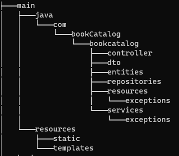

# Springboot-CRUD

## Estrutura do projeto



- **controller**: Este diretório contém as classes responsáveis por receber as requisições HTTP e lidar com a lógica de negócio relacionada às requisições. 
- **dto**: Este diretório contém as classes que representam objetos de transferência de dados (DTO) utilizados para transportar dados entre a camada de controle e serviço. 
- **entities**: Este diretório contém as classes de entidades que representam objetos persistentes no banco de dados. Exemplo: 
- **repositories**: Este diretório contém as interfaces responsáveis por definir as operações de acesso a dados para as entidades.
- **resources**: Este diretório contém recursos estáticos, como arquivos de propriedades de configuração. Exemplo: application.properties.
- **resources/exceptions**: Este diretório contém as classes de exceção personalizadas para tratamento de erros específicos da aplicação. Exemplo: CustomException.java.
- **services**: Este diretório contém as classes que implementam a lógica de negócio da aplicação. Exemplo: ProductService.java.
- **services/exceptions**: Este diretório contém as classes de exceção personalizadas relacionadas aos serviços. Exemplo: ServiceException.java.
- **test**: Este diretório contém os arquivos de teste para as classes do projeto.

## **Requisitos para rodar o projeto:**

1. Java 11: Certifique-se de ter o JDK (Java Development Kit) 11 instalado em sua máquina. Você pode verificar a versão do Java digitando o seguinte comando no terminal ou prompt de comando:
   ```
   java -version
   ```

2. Maven: O projeto utiliza o Maven como gerenciador de dependências. Verifique se você tem o Maven instalado executando o seguinte comando:
   ```
   mvn -version
   ```

3. Banco de dados: O projeto utiliza o banco de dados H2 para desenvolvimento e teste. Certifique-se de ter o H2 Database instalado ou configure seu próprio banco de dados PostgreSQL.

## **Setup do ambiente:**

1. Clone o projeto: Inicialmente, clone o projeto do repositório Git para sua máquina local usando o seguinte comando:
   ```
   git clone https://github.com/seu-usuario/bookcatalog.git
   ```

2. Importe o projeto: Abra sua IDE preferida (por exemplo, IntelliJ IDEA, Eclipse) e importe o projeto como um projeto Maven existente.

3. Aguarde a importação: A IDE irá baixar todas as dependências do Maven e configurar o projeto automaticamente. Isso pode levar alguns minutos, dependendo da velocidade da sua conexão com a internet.

4. Configuração do banco de dados (opcional): Se você preferir usar o banco de dados PostgreSQL em vez do H2, atualize as configurações de conexão do banco de dados no arquivo `application.properties` ou `application.yml` do projeto.

## **Como rodar na minha máquina?**

1. Execute o aplicativo: A partir da sua IDE, localize a classe principal `bookcatalogApplication` e execute-a como uma aplicação Java. Isso iniciará o servidor embutido do Spring Boot e implantará o projeto.

2. Acesse o aplicativo: Depois que o aplicativo for iniciado com sucesso, você pode acessá-lo em seu navegador da web usando a seguinte URL:
   ```
   http://localhost:8080
   ```

   A partir daí, você poderá interagir com o aplicativo por meio da interface do usuário ou fazer chamadas para a API REST, dependendo do propósito do projeto.
